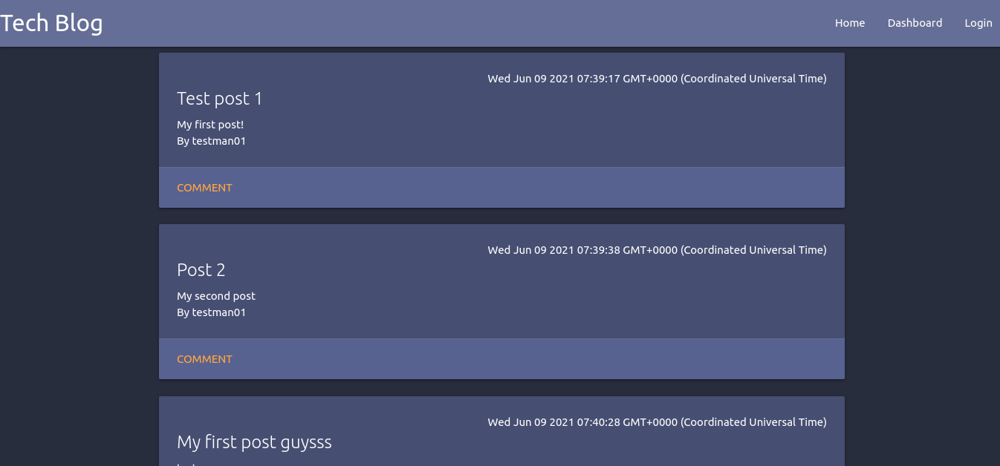

# Tech Blog

### Project Created By: Hunter Barton

## **Description**

A basic wordpress - like blog site. Users can create an account and then add posts, comment on posts, edit their own posts, and view others posts. This project was built using `express` and `MySQL`. It is all server side rendered and quite fast.

---

## **Table of Contents**

-  [Installation](#installation)
-  [Usage](#usage)
-  [License](#license)
-  [Contributing](#contributing)
-  [Tests](#tests)
-  [Questions](#questions)

---

## Installation

First install node and npm. Then navigate to the repo folder and run `npm i`. This will install all node packages needed.  
Next launch mySQL and run `source db/schema.sql`.Then create a `.env` file. This should contain:

```
DB_NAME='blog_db'
DB_USER='root'
DB_PW=''
```

_(replace user and pw with your username and password for mySQL)_  
Lastly run `npm run seed` and you are seeded and ready to go.

## Usage

To use this site either navigate to my deployed URL or run `npm start` in your local repo folder, then launch a browser and go to `localhost:3001`
Once at the site you will be able to use the intuitive user interface to create an account, create your first blog post, and comment on other users' posts.

## Screenshots



## Configuring

No configuration necessary

## Technologies Used

---

-  node.js
-  express.js
-  MySQL
-  Sequelize ORM
-  Handlebars
-  MaterializeCSS
-  bcrypt

---

## Contributing

Simply create a pull request and document your changes well and I will review it.
If you would like to add to this project, you can [follow me on GitHub](https://github.com/mythosmystery).

## Tests

Launch the site and test away

## Questions:

If you have any questions about this project, you can reach me [on GitHub](https://github.com/mythosmystery)
or via email at axiysfire@gmail.com.

## License

MIT
[](https://opensource.org/licenses/MIT)

**Tech Blog created 06-09-2021, by Hunter Barton.**
